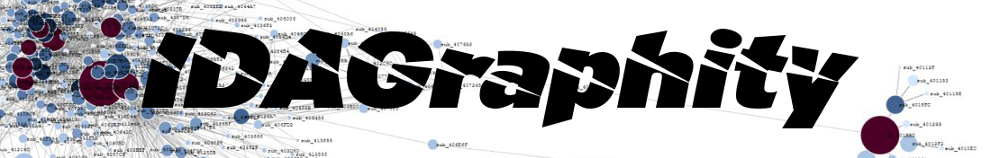
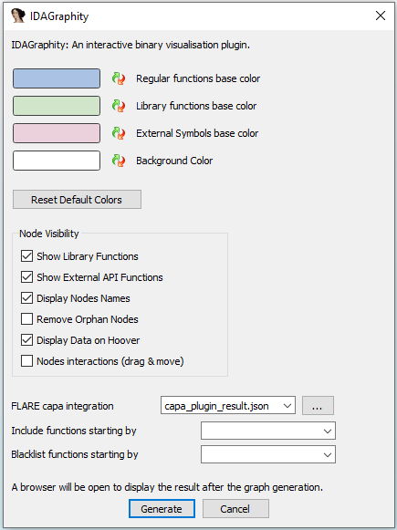
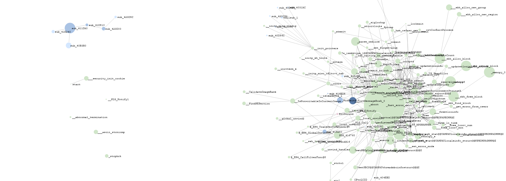
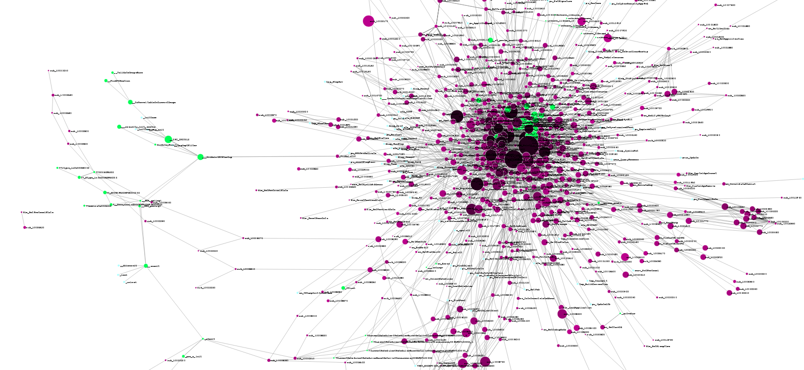
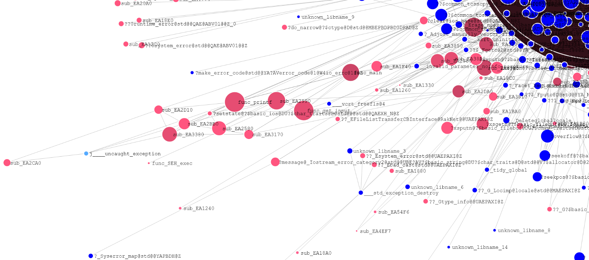
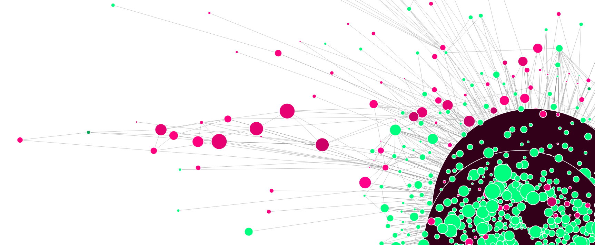
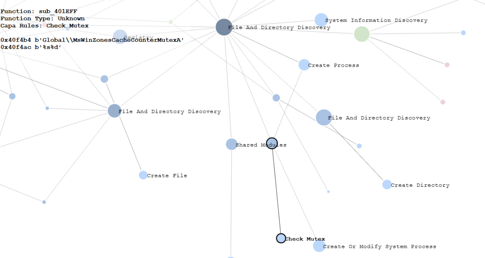
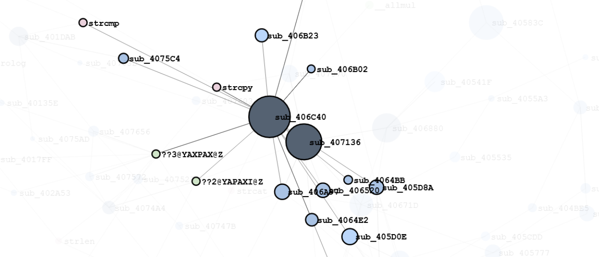
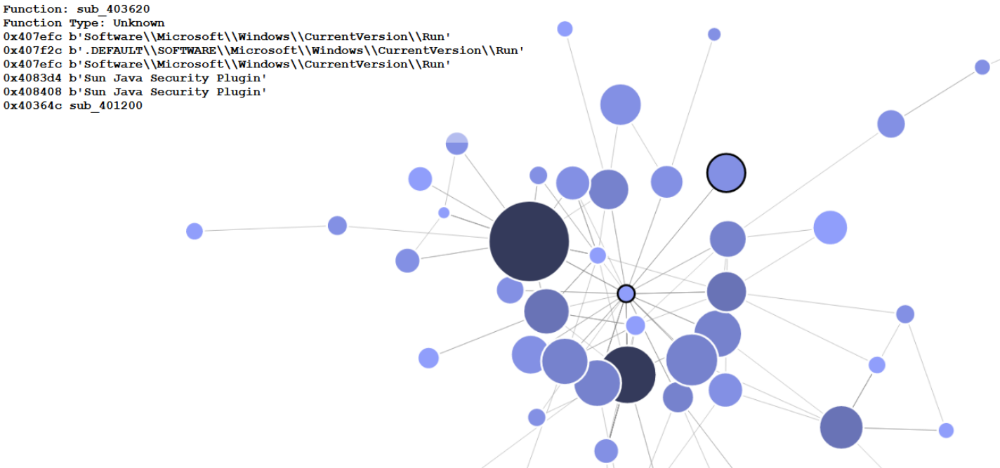
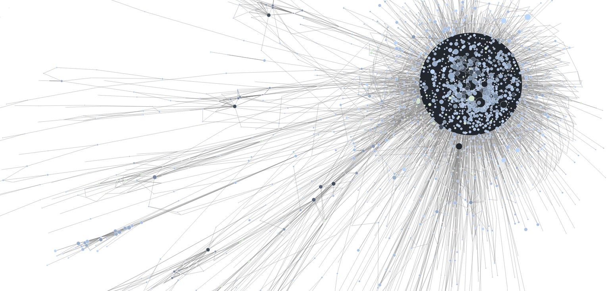

IDAGraphity: An Interactive Binary Data Visualization Plugin for IDA Pro.

## 🚀 Installation 

In order to use this plugin, the content of the "plugin" folder must be placed in the "IDA/plugins/" folder.

The *IDAGraphity.py* file must be edited for the first run: the **PLUGIN_DIR** variable must be updated with the full path of the IDA plugin directory.

## 🔌 Supported versions

IDAPython version 3 must be installed.

Support for IDA Pro starting at version 7.

## ⚙️ Configuration

The plugin is available under IDA: "Edit -> Plugins -> IDAGraphity".

Some configurations options are available:



* Show Library Functions: (default=True) Includes functions nodes that IDA detected as "library function" in the graph.
* Show External API Functions: (default=True) Includes functions nodes that link to external Windows API / DLL in the graph.
* Display Nodes Names: (default=True) Includes the name (taken from the idb) for each node in the graph.
* Remove Orphan Nodes: (default=False) Removes orphan nodes (nodes that do not have any connection) from the graph.
* Display Data on Hoover: (default=True) Shows additional information about the selected node in the top left corner of the page.
* Nodes Interactions: (default=False) Updates the graph layout in real time when moving a node around the page.

* FLARE capa integration: Links to a local json file produced by the "FLARE capa explorer" IDAPro plugin. When provided, the graph will show the functionalities that capa detected. "Display Nodes Names" is recommended to be set to False for a better visivility.

* Include function starting by: Only includes functions starting by the provided prefix in the graph.
* Blacklist functions starting by: Removes nodes starting by the provided prefix in the graph.

## 🪄 Usage

A similar output can be observed in the IDA Pro "Output" tab when a graph is generated:
```
==========================
IDAGraphity plugin: 436 Nodes created
IDAGraphity plugin: 2236 Links created
IDAGraphity plugin: Object saved under "Z:\Samples\C:\Tools\IDA 7.7\IDA 7.7\plugins\IDAGraphity\d3.json"
--- 0.182326078414917 seconds ---
```

A browser window will be open with the result of the constructed graph. For instance:


The following aspect may help understand the generated layout when browsing the graph:
* Each function is represented by a node.
* Each call between functions is represented by edges between nodes.
* The darker the color is, the more API calls the functions contains.
* The bigger the node is, the more instruction is contains.
* Blue color is for regular functions.
* Green color is for embedded library functions.
* Pink color is for external API functions.
* The node's name is based on the name of the function's name in the .idb file.
* When hoovering over a node, the top-left corner of the screen will display the function's strings and the callee's name.
* When clicking on a node, the first level of relation with other nodes will be highlighted.
* Zooming can be done with the mouse-wheel or with a double click on the page.

## 💢 Troubleshooting and current limitations

* As the plugin can create a layout of a binary with 100K functions / links in a few seconds, the d3.js script used to render the graph in the browser will not be able to handle that much data. If the webpage is hanging for too long, it might be because the dataset is too heavy to load. I recommend not to try to render binary with more than 20K functions/links.

* Orphan nodes may appear from times to times. This can be explained by the fact that some functions of the target binary are never called. This can be an artifact from a dynamically called function that IDA is not able to follow properly. It can also be a specific case that the plugin is not handling well.

* If the render page is blank, the "same-origin policy" might be enabled in the browser. This must be disabled before using this plugin. Such an error can be detected using the "Console" tab of the browser developer's tools. (Firefox : "about:config -> security.fileuri.strict_origin_policy -> False")


## 🎉 Showcase


_1) A graph with a lot of nodes gravitating around a central point_


_2) Distinctions between user code functions and library functions with customs colors_


_3) A graph without nodes names and custom colors for the show_


_4) A graph produced with a capa file that display the behavior of the functions_


_5) A subset of a bigger graph selected by the user, with library functions and external Windows API nodes_


_6) Information box in the top-left corner displayed on node hover which shows a persistence mechanism_


_7) A huge scary monster graph_

## ✏️ Special mention

This plugin is heavily-inspired by  from pinkflawd (https://twitter.com/pinkflawd) with her work on .
